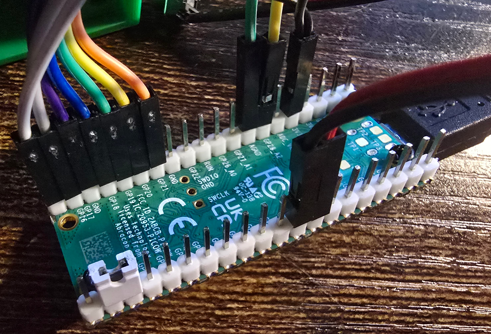
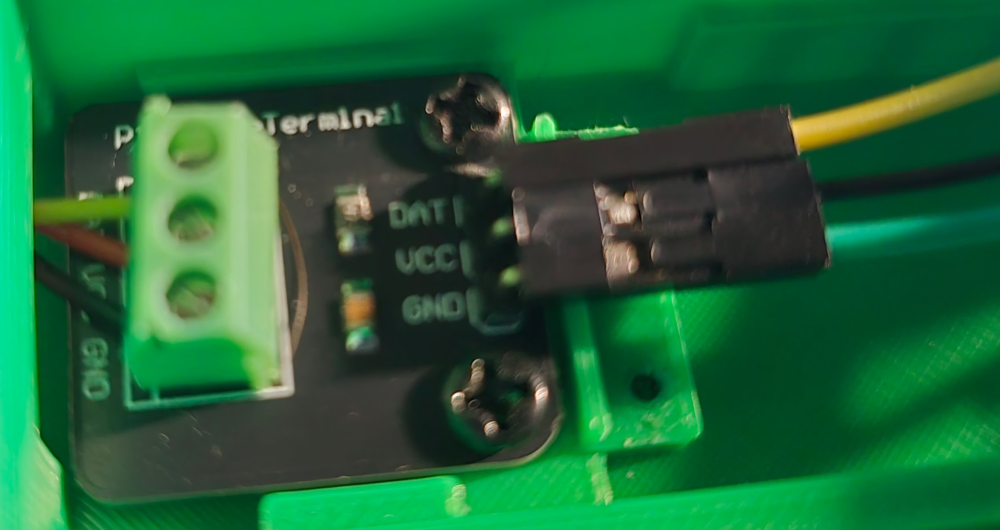
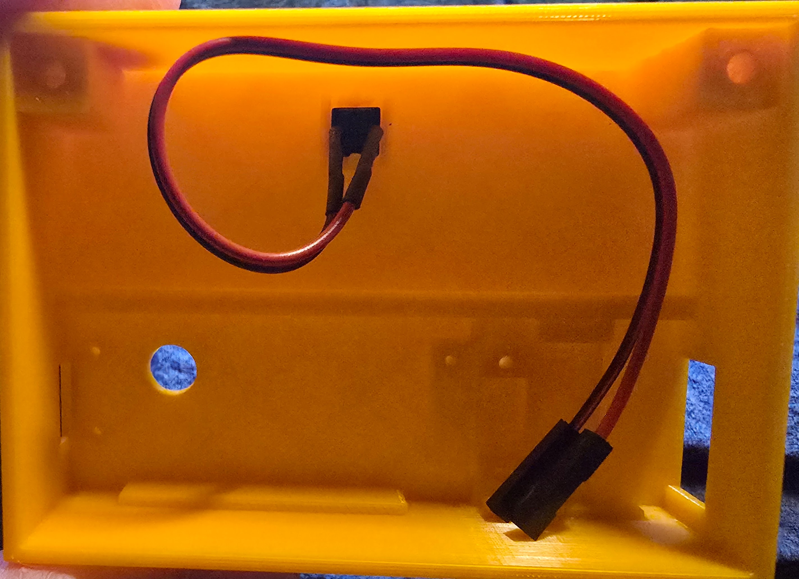
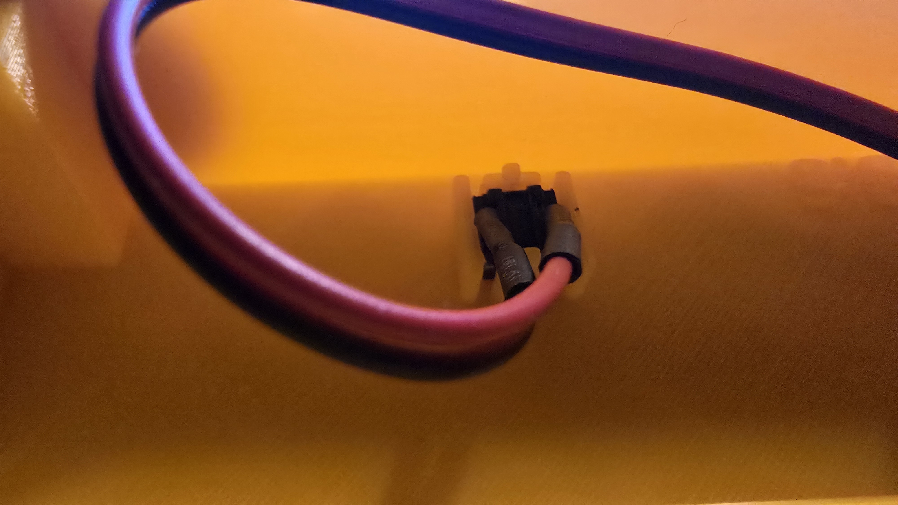
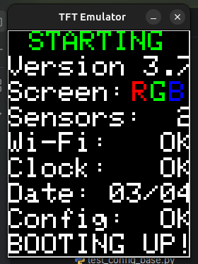

Building Your Own
=================

This covers the assembly of one of these temperature sensors

.. important::
    There are a few tools and items which will be needed to construct this.

    - The primary one is the 3D printer itself.
      I am getting by with a very small hobby 3D printer that I got off of Amazon `here <https://www.amazon.com/dp/B0CMHM6XQG>`__.
      It has a very small print area, which has forced me to rethink the design multiple times, for better or for worse.
    - You will need some very small screw drivers, both flat and phillips, and both in the 1-3mm range.
      A set like `this <https://www.amazon.com/Screwdriver-Flathead-Phillips-Screwdrivers-Computer/dp/B0BMWQNMPS/>`__ is great.
    - You will also want some wire strippers for small wires.  I found `this one <https://www.amazon.com/dp/B07D25N45F>`__ to work pretty well.
    - You will need one data-transfer-enabled USB micro cable to upload the firmware to the Pico.  One example is this: https://www.amazon.com/dp/B074VM7SMM.  If the cable is a power-only cable, it will not connect to the computer properly.  While it's not a 100% guarantee, the general consensus is that if the micro port has the USB trident logo on it, it should be a data cable.  Charge-only cables rarely have this.

Parts List
----------

The parts list will be updated with each release of the sensor.
I will use Amazon links, but definitely feel free to source them elsewhere.
Just note that if the dimensions change at all, the 3D print would need to be modified.

+-----------------------------------------+-----------+-----------------------------------------------+
| Item                                    | Quantity  | Link                                          |
+=========================================+===========+===============================================+
| Raspberry Pico W                        | 1         | https://www.amazon.com/dp/B0BMP5546H          |
+-----------------------------------------+-----------+-----------------------------------------------+
| DS18x20 temperature sensors             | 1 or 2    | https://www.amazon.com/dp/B09NVFJYPS          |
+-----------------------------------------+-----------+-----------------------------------------------+
| DS18x20 breakout board                  | 1         | https://www.amazon.com/dp/B09NVWNGLQ          |
+-----------------------------------------+-----------+-----------------------------------------------+
| 1.8", 128x160, ST7735r color LCD screen | 1         | https://www.amazon.com/dp/B00LSG51MM          |
+-----------------------------------------+-----------+-----------------------------------------------+
| Female-to-female jumper cables          | 9         | https://www.amazon.com/dp/B0BRTKTV64          |
+-----------------------------------------+-----------+-----------------------------------------------+
| Female-to-dual-female splitter jumper   | 1         | https://www.amazon.com/dp/B0DSZWFS1V          |
+-----------------------------------------+-----------+-----------------------------------------------+
| Small surface button switch (reset)     | 1         | https://www.amazon.com/gp/product/B01J9KO7DC  |
+-----------------------------------------+-----------+-----------------------------------------------+
| Jumpers for dev mode and RGB invert     | 1         | https://www.amazon.com/dp/B0FHGXX6SK          |
+-----------------------------------------+-----------+-----------------------------------------------+
| Small screws (exact sizes below)        | A few     | https://www.amazon.com/dp/B081DVZMHH          |
+-----------------------------------------+-----------+-----------------------------------------------+
| USB Micro cable and block (size approx) | 1         | https://www.amazon.com/dp/B07P5CP5KP          |
+-----------------------------------------+-----------+-----------------------------------------------+

A single case will require these screw sizes and quantities:

- Pico: 3 M2x6mm
- Breakout board: 2 M3x5mm
- Screen: 3 M2.3x5mm
- Case: 2 M2.3x10mm

Notes:

- Most of the item links about contain a bulk amount of that product, so each purchase would support multiple/many sensor boxes.  For example, the female splitter product has 10, even though each sensor only needs one wire.
- The cases do need their own USB micro power cable, just pick a length that works for you and include a power brick.
- I'm still working out the mounting process.  One option is to use magnets like `these <https://www.amazon.com/dp/B072KDBJWC>`__.  Another option would be to use a metal bracket hanging on the door.  In many cases, you may be able to just set the sensor on top of the fridge.

Assembly Steps
--------------

.. important::
    Make sure you use the 3D models, parts list above, code/firmware, and these instructions all from the *same* release.
    Failure to do so may result in parts not fitting or incompatible code.

Gathering Materials
*******************

- Select a specific release of the sensor repo from `here <https://github.com/okielife/TempSensors/releases>`__.
- The releases will have all necessary files: 3D models, assembly instructions, and firmware.
- Order any needed parts from the parts list above.

.. _first_steps:

First Steps
***********

- Print the 3D models provided in the release asset using your 3D printer workflow, or perhaps even order a print from online
- Test fit the screen, breakout board, and Pico, checking that the screw holes line up properly
- Generate a serial number for this box.  Maybe use the same labels as for the wires.  This list is currently started in the `dashboard config file <https://github.com/okielife/TempSensors/blob/main/dashboard/_data/config.json>`__.
- Generate AND SAVE a new token named after the box serial number

  - If not already done, create a GitHub user to be the "bot" pushing data to the repo
  - Make sure that bot is invited to collaborate in the repo so that it will have write access
  - Log in with that user and generate a new token:

    - Go to https://github.com/settings/tokens/new
    - Choose your preferred expiration time
    - Choose only ``repo->public_repo`` access so that it can post results
    - Select ``Generate Token``
    - Save the token text somewhere safe, preferably a secure local file.  The token will be secret forever after leaving that GitHub page.  During provisioning, the phone or computer connected to the sensor will need that token and will not have internet access.

.. _installing_the_pico:

Wiring Details
**************

A description of the wiring connections, or pinout as I like to call it, is available on the online docs as well as provided as a release asset PDF along with the PDF instruction manual.
Throughout these instructions, consult the :ref:`pinout <pinout>` for all wiring details.
It may be helpful to open it in a new tab, or even better, in split view, next to these instructions.

Flashing the Pico
*****************

- This is easier to do before mounting the Pico.  If you did already mount the Pico, you can use a small hole in the box to access the BOOTSEL button.
- There is a custom MicroPython firmware build available as a sensor release asset, with all sensor code pre-frozen into the firmware.
- The preferred approach would be to flash that directly onto the Pico, as no other steps or programs are necessary with a computer.
- To flash the Pico, hold the BOOTSEL button while plugging it into the computer with a data-transfer-capable USB micro cable and it will mount a drive on the system.  Drag the .uf2 firmware file on there, and once copied, it will reboot the Pico; all done.

.. important::
   Flashing the Pico with MicroPython does **not** erase the filesystem portion of the Flash drive.  So previous files may or may not exist.
   If you are using a Pico which has been through multiple applications, you may want to consider wiping the flash entirely.
   You can find methods to reset the board's filesystem online.  This may not even be an issue with the custom firmware we create, and this is definitely not an issue for new Pico boards.

Temperature Sensor(s)
*********************

The temperature sensor system will work with either one or two temperature sensors connected through the same breakout board and GPIO pin.

- Use the wire strippers on the temperature sensor(s) to trim back the black covering
- Strip the wires using a 22 gauge slot to about a quarter inch of exposed wire to give a good amount to hold in the sensor

  - You do *not* want too much wire exposed, as accidental short circuits here will cause a warm box and a risk.
  - It seems finicky at first, but it is very possible to get a clean wire strip and end up with nice terminated ends to put in the screw terminals.
  - Also it would be ideal to get all three wires stripped very close to the same position next to each other, so there is no unnecessary stress on each wire pulling or pushing on the other ends.

- Unscrew the breakout board terminal screws to open the ports, then screw the sensor(s) wires into the sensor breakout board tightly

  - Yellow to DAT, red to VCC, and black to GND
  - It may be helpful to use a desktop stand that has alligator clips to hold the wires together as you insert them and screw the terminals in.

- Add jumper cables to the sensor breakout board pins:

  - Female to female for the ground and data, preferably brown for ground and yellow for data
  - One of the ends of female-female-female wire splitter on the vcc

.. important::
    If you are adding a new temperature sensor to the pool of known sensors, there are a couple extra steps, and this is the right time to do them!
    See the :ref:`adding_a_new_sensor` section for more information there.

Installing the Pico
*******************

- Attach 7 female-to-female jumper wires to Pico GP21 - GP16, which will all wire to the screen
- Assuming you are starting with a debugging session (you are), put a jumper from pin GP14 to ground
- Attach the central end of the wire splitter to the 3V3 pin on the Pico

At this point, the Pico should look something like this:

- Place the Pico pins up with the USB port facing the power cable access hole in the case
- Screw in Pico with 3 M2x6mm screws

Installing the Sensor Breakout Board
************************************

- Feed sensors wires from inside through to the outside
- Screw board into place with 2 M3x5mm screws

This image needs to be replaced, but it basically shows the sensor breakout board wiring.  (It shows the board installed without the Pico under it and it's unfocused)

If any holes are not aligned, you may have received an incompatible part or ordered the wrong materials for this case design.

Installing the Factory Reset Switch
***********************************

The sensor boxes have a button to allow re-provisioning, if the Wi-Fi ever changes, or the GitHub token needs to change.
Push this button while the system boots, and it should clear custom runtime configuration and start fresh with a new provisioning experience.

The 3D printed box has a premade hole on the back, with a little bracket to mount the switch from the inside.
This bracket design and mount process have not been refined, so it can be a little finicky.
As of version 3:5 of the case, I feel OK about it, but I look forward to polishing it up.

The button is on the back, as seen here from the back external view and the top internal view:

..  .. image:: images/reset_button_external.jpg
..  :alt: External view of the factory reset button
..  :width: 45%

Basically just take the switch and try to pivot it side to side while pushing until it seats itself in the slot.
Plug the switch into the Pico GP6 and GND pins.
A close up view may help:

But for that picture to help, it would require better photography skills. :)

Final Wiring
************

- Attach 7 jumper wires from the Pico to the screen
- Attach the VCC splitter end to the screen
- Attach the 2 remaining sensor wires to the pico (sensor DAT to GP28, sensor GND to GND)

First System Test
*****************

- If you are running with the new custom firmware, you can skip this step entirely and move on to :ref:`provisioning <provisioning>`.
  No files need to be transferred as they were all pre-frozen into the custom firmware.
- Make sure debug jumper is connected
- Open Thonny on the computer
- Plug in the temperature sensor using the data-enabled USB micro cable
- Otherwise you will need to transfer the firmware files manually:

  - Open the file sidebar and browse for the code stored locally on your machine
  - Copy the main.py file from the repo to the Pico root by right clicking and choosing "Upload to /"
  - Create a firmware directory on the Pico file system
  - Double click that folder on the Pico to focus on it
  - Then on each of the following files, right click on the local file and choose "Upload to /firmware/"

    - board_base.py
    - board_pico.py
    - config_base.py
    - config_data.py
    - config_pico.py
    - font.py
    - screen_base.py
    - screen_tft.py
    - sensing.py
    - st7735.py
    - __init__.py

- The sensor box firmware is now set up and ready to be provisioned.

.. _provisioning:

.. important::
   Before beginning the provisioning step, make sure to get the GitHub token created above and have it ready to paste in.
   While connected to the Pico's own network for provisioning, you will not have internet access.

Provisioning the Runtime Configuration
**************************************

  - Plug in the Pico, either to the computer or a normal power source. It doesn't matter, as file transfer is complete at this point.
  - The sensor box should launch a small Wi-Fi server and HTTP server
  - The Wi-Fi network should be listed on the screen, so connect to that from a device (phone or laptop)
  - Once connected to that network, scan the QR code on the screen, or browse to http://192.168.4.1 (not https)
  - Paste in the GitHub token generated in the :ref:`first steps <first_steps>` above.
  - If the sensor should connect to a Wi-Fi network not listed, add the credentials there
  - Once submitted, the sensor should reboot and go into debug mode

- Take note of the POST screen as shown in :ref:`the figure below <tk-post>`.  The SCREEN section shows RGB, with R in red, G in green, and B in blue.
- Execute sensing.py, and if those are reversed in the hardware, then place a jumper between GP10 and ground to reverse BGR to RGB.
- Once everything is working well, you are ready to wrap the build!

.. _tk-post:

Final Steps
*****************

- Screw screen to lid using 3 M2.3x5mm screws
- Take out debug jumper that was connecting pin 14 to ground
- Snap lid into place and screw together using 2 M2.3x10mm screws - push in hard at first to break through plastic, then screw in
- Deploy to wherever you want, hanging sensors inside fridge/freezer doors.
- Once you are satisfied it is working well, make sure to set the sensor to active in the dashboard/_data/config.json file
