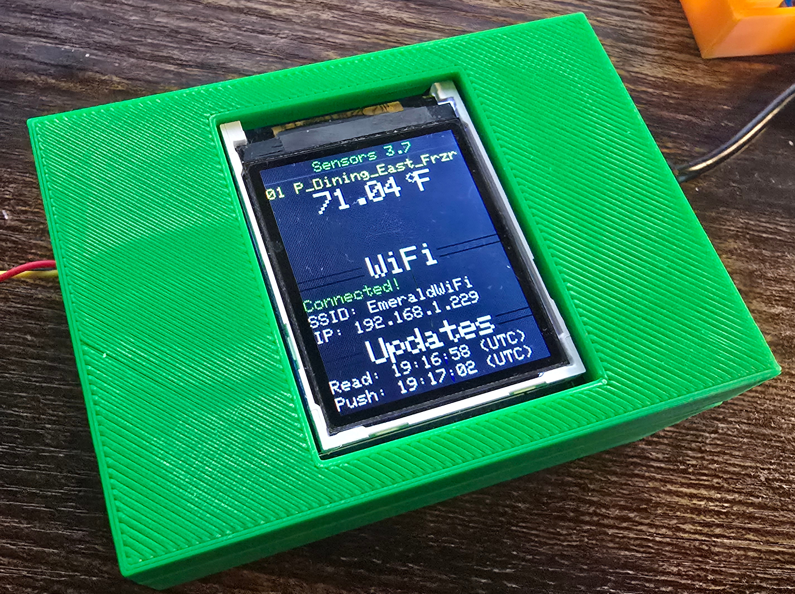

Temperature Sensing
===================

This project started as a small side task to build a temperature sensor to monitor a freezer at a food pantry.
It is still focused on that, but has become a critical part of my own self-learning journey.
Here is a sample of one of the sensors, showing the boot up POST screen:

In summary, the temperature sensors are based on:

- a compact and simple 3D printed box (case and lid), with STL files provided
- a Raspberry Pico W to do all the computing
- a small TFT screen for local readout
- common DS18x20 temperature sensors
- an array of common parts, with a full parts listed provided
- polished provisioning step leveraging the Pico's Wi-Fi access point
- custom-built MicroPython firmware with temperature sensor code frozen in place
- full documentation, including a separate assembly instruction manual PDF
- flexible code that utilizes abstract screen, config, and controller base classes
- fully tested source code, targeting 100% coverage
- GitHub to store the data, build the dashboard, run checks, and alert for out of range temperatures or unresponsive units

.. toctree::
   :maxdepth: 2
   :caption: Contents:

   assembly
   pinout
   developer
